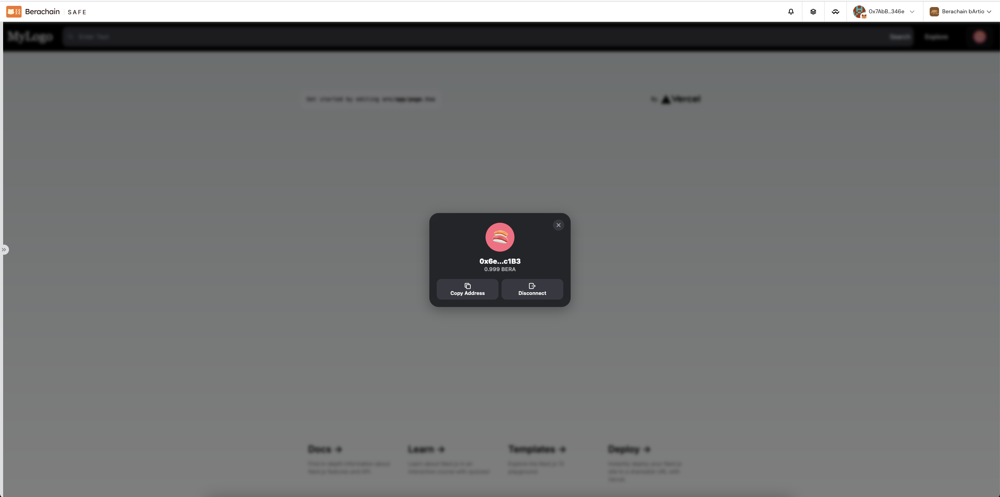

This is a [Next.js](https://nextjs.org/) project bootstrapped with [`create-next-app`](https://github.com/vercel/next.js/tree/canary/packages/create-next-app).

## Getting Started

First, run the development server:

```bash
npm run dev
# or
yarn dev
# or
pnpm dev
```
## Add Wagmi to the project, install the required packages

```
yarn add wagmi viem@2.x @tanstack/react-query
```
Viem [https://viem.sh](http://localhost:3000) is a TypeScript interface for Ethereum that performs blockchain operations.

TanStack Query [https://tanstack.com/query/v5](http://localhost:3000) is an async state manager that handles requests, caching, and more.

## Install Rainbowkit
```
yarn add  @rainbow-me/rainbowkit
```
Let’s create and export a new config using createConfig, in lib/config.ts
```
'use client';

import { http, createStorage, cookieStorage } from 'wagmi'
import { berachainTestnetbArtio } from "viem/chains";
import { Chain} from '@rainbow-me/rainbowkit'
import { createConfig} from "wagmi";
import { injected, safe } from "wagmi/connectors"; /** Config Safe Apps */

const supportedChains: Chain[] = [berachainTestnetbArtio];

export const config = createConfig({
    chains: supportedChains as any,
    connectors: [safe(), injected()],
    ssr: true,
    storage: createStorage({
        storage: cookieStorage,
    }),
    transports: supportedChains.reduce((obj, chain) => ({ ...obj, [chain.id]: http() }), {})
});
```
Config Safe Apps
```
import { injected, safe } from "wagmi/connectors";
```

In app/providers.tsx, add :
```
"use client";

import { QueryClient, QueryClientProvider } from "@tanstack/react-query";
import {WagmiProvider } from "wagmi";
import { RainbowKitProvider, darkTheme } from "@rainbow-me/rainbowkit";
import { config } from "@/lib/config";

export const queryClient = new QueryClient();

type Props = {
  children: React.ReactNode;
};

export default function Providers({ children }: Props) {
  return (
      <WagmiProvider config={config}>
        <QueryClientProvider client={queryClient}>
          <RainbowKitProvider
              theme={darkTheme({
                accentColor: "#0E76FD",
                accentColorForeground: "white",
                borderRadius: "large",
                fontStack: "system",
                overlayBlur: "small",
              })}
          >
            {children}
          </RainbowKitProvider>
        </QueryClientProvider>
      </WagmiProvider>
  );
}

```

## Test on Safe Apps
https://safe.berachain.com/apps/open?safe=berachainbArtio:0x6e35fCb0c2A6302571169b1EB5B15Cf6DF75c1B3&appUrl=http://localhost:3000


